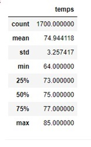
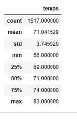

# surfs_up
SQlite, SQLalchemy, Flask

## Module 9 Challenge

## Process:
The code for the Module 9 challenge, "Climate Analysis" can be found in the Jupyter Notebook file, "Mod_9_Challenge_climate_analysis.ipynb".

The challenges asks that we conduct an analysis of the climate for the months of June and December in order to assess the viability of a surf shop / cafe on the island of Oahu
in Hawaii.

First I imported the dependencies, including Matplotlib, pandas, numpy, as well as various elements of SQL Alchemy (e.g. automap_base, session, create_engine, etc.).
Then I used the create_engine element of SQL Alchemy to establish a connection to the local SQLite database.  I used automap_base to create a new instance (reflection) of the SQLite dataset.  I then saved references to each table (measurement, station).  Then a link from Python to the database was established using the 'sessions' element.

Then using a query I used numpy to determine the mean temperature for the data limiting first to June, and then December.

Average temperature for the month of June:

Average temperature for the month of December:

## Interpretation:

The mean temperature in June on Oahu is 75 degrees (min = 64, max = 85) while in December it is 71 degrees (min = 56, max = 83).  The means are not very different (nor the min/max) so I can conclude that June and December are equally okay for conducting business renting surfing gear and serving food (at least as far as the average temperature is concerned).

## options for further analysis
I might proceed to look at average precipitation at different periods during the year to see if there are particularly rainy months wherein folks are not too inclined to go surfing and business might be negatively affected.  

I could plot the averages of temperature and precipitation as a bar chart by month during the year to visually depict the levels of each throughout the year.  This would be helpful to convince investors that there are no periods during the year when business would not be great due to the weather.
